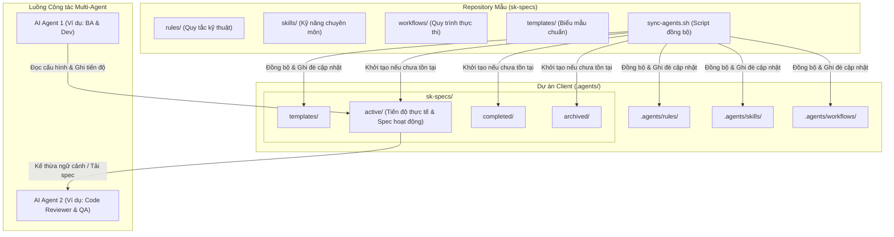

# Đặc tả Kỹ thuật Hệ thống Multi-Agent Collaboration

Tài liệu này mô tả kiến trúc và quy trình cộng tác giữa nhiều AI Agent (Multi-Agent Collaboration) thông qua việc sử dụng cơ chế đồng bộ hóa cấu hình rules, skills, workflows và chia sẻ ngữ cảnh spec persistence.

---

## 1. Sơ đồ Kiến trúc & Luồng Dữ liệu

Dưới đây là sơ đồ mô tả cách thức đồng bộ cấu hình từ kho chứa mẫu (`sk-specs`) sang dự án client, cùng cách các AI Agent tương tác chung trên thư mục đặc tả `.agents/sk-specs/active/`:



---

## 2. Nguyên lý Hoạt động của Mô hình Multi-Agent

Hệ thống hoạt động dựa trên hai cơ chế cốt lõi được định nghĩa trong thư mục `rules/`:
1. **Spec Loading (`spec-loading.md`)**: Trước khi bắt đầu thực hiện bất kỳ nhiệm vụ nào (Feature, Bugfix, Refactor), AI Agent bắt buộc phải quét thư mục `.agents/sk-specs/` để tải lên các quyết định kiến trúc (`decisions.md`), phân tích nghiệp vụ (`ba.md`), và tiến độ hiện tại (`progress.md`).
2. **Spec Persistence (`spec-persistence.md`)**: Trong và sau quá trình làm việc, Agent tự động cập nhật tiến độ vào file `progress.md` và ghi nhận các quyết định vào `decisions.md`. 

Nhờ cơ chế này:
- **Tính liên tục (Context Continuity)**: Khi Agent 1 dừng lại (hoặc bị ngắt kết nối/hết lượt), Agent 2 chỉ cần đọc nội dung trong thư mục `active/` để tiếp tục công việc mà không cần người dùng mô tả lại từ đầu.
- **Tiết kiệm Token (Prompt Size Reduction)**: Các Agent không cần đọc lại toàn bộ mã nguồn lớn mà chỉ cần tập trung vào các file đặc tả nghiệp vụ và kỹ thuật đã được tinh giản.
- **Tính nhất quán**: Các quyết định kiến trúc đã ghi nhận trong `decisions.md` giúp ngăn chặn Agent sau đưa ra thiết kế mâu thuẫn với Agent trước.

---

## 3. Chi tiết Cấu trúc Thư mục tại Dự án Client

Sau khi đồng bộ, thư mục `.agents/` tại dự án client sẽ có cấu trúc như sau:

```txt
.agents/
├── rules/                  # Các ràng buộc kỹ thuật bắt buộc của dự án
│   ├── core-rules.md       # Vai trò, thứ tự ưu tiên và workflow bắt buộc
│   ├── architecture-rules.md  # Quy chuẩn cấu trúc frontend (Zustand, State, v.v.)
│   ├── spec-loading.md     # Quy tắc tải ngữ cảnh
│   └── spec-persistence.md # Quy tắc lưu trữ tiến độ
├── skills/                 # Tài liệu hướng dẫn kỹ năng chuyên môn cho Agent
│   ├── business-analysis.md
│   └── react-zustand-patterns.md
├── workflows/              # Các bước thực thi chi tiết cho từng tác vụ
│   ├── business-analysis.md
│   ├── feature-analysis.md
│   └── fix-bug.md
└── sk-specs/               # Nơi lưu trữ thông tin nghiệp vụ và tiến độ cộng tác
    ├── active/             # Các task/feature đang được thực hiện (mỗi task là 1 thư mục con)
    ├── completed/          # Các task/feature đã hoàn thành
    ├── archived/           # Các tài liệu đã lưu trữ lịch sử
    └── templates/          # Các file biểu mẫu chuẩn được copy từ sk-specs sang
        ├── ba.md           # Mẫu Business Analysis
        ├── feature.md      # Mẫu đặc tả kỹ thuật tính năng
        ├── progress.md     # Mẫu cập nhật tiến độ
        └── decisions.md    # Mẫu ghi nhận quyết định kiến trúc
```

---

## 4. Quy trình Vận hành Đồng bộ

Khi có sự thay đổi về quy tắc (`rules`), kỹ năng (`skills`) hoặc quy trình (`workflows`) tại repository gốc `sk-specs`, người quản trị chỉ cần chạy script đồng bộ:

```bash
./sync-agents.sh <path-to-client-project>
```

### Cách xử lý ghi đè an toàn:
- **Quy tắc & Quy trình**: Các thư mục `rules/`, `skills/`, `workflows/`, `templates/` sẽ được xóa sạch ở client và copy mới để đồng bộ các cập nhật quy chuẩn mới nhất.
- **Dữ liệu thực tế**: Các thư mục chứa dữ liệu tiến độ thực tế bao gồm `active/`, `completed/`, `archived/` sẽ **chỉ được tạo nếu chưa có** và **hoàn toàn không bị ghi đè hay xóa bỏ** nếu đã tồn tại, đảm bảo không làm mất dữ liệu công việc hiện tại của các agent ở dự án client.

---

## 5. Cơ chế Chuyển giao Công việc tự động giữa các Agent

Một điểm quan trọng trong thiết kế hệ thống Multi-Agent là **bạn không cần chạy lại script `sync-agents.sh` khi chuyển đổi công việc qua lại giữa các Agent**.

### Phân định vai trò của Script và Runtime Spec:
*   **Script `sync-agents.sh` (Cấu hình tĩnh)**: Chỉ dùng để thiết lập hoặc cập nhật các quy định chung (`rules`, `skills`, `workflows`, `templates`) từ kho chứa tiêu chuẩn `sk-specs` sang dự án client.
*   **Thư mục `.agents/sk-specs/active/` (Dữ liệu động)**: Lưu trữ trạng thái và ngữ cảnh làm việc thực tế của tác vụ hiện tại.

### Quy trình tự động kế thừa ngữ cảnh:
Khi chuyển giao công việc từ Agent này sang Agent khác, quy trình diễn ra khép kín qua các bước:

1.  **Ghi nhận tiến độ (Agent tiền nhiệm)**: Agent đang làm việc tự động cập nhật tiến độ chi tiết của các task/subtask vào file `progress.md` và các quyết định thiết kế vào `decisions.md` nằm trong thư mục active của tính năng.
2.  **Khởi động Agent mới (Agent kế nhiệm)**: Khi Agent mới bắt đầu làm việc trên workspace client, nó sẽ đọc file `rules/spec-loading.md`.
3.  **Tự động nạp ngữ cảnh**: Agent kế nhiệm tự động phân tích thư mục `active/` để tìm task tương ứng, đọc file `progress.md` để biết công việc đang dừng ở bước nào, đọc `ba.md` và `decisions.md` để hiểu yêu cầu nghiệp vụ và các quyết định kỹ thuật đã thống nhất.
4.  **Tiếp tục triển khai**: Agent mới tiếp tục thực hiện các bước tiếp theo trong kế hoạch mà không cần người dùng phải cung cấp lại ngữ cảnh hoặc chạy bất kỳ script đồng bộ nào.

