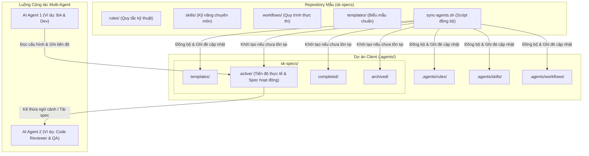

# Đặc tả Kỹ thuật Hệ thống Multi-Agent Collaboration

Tài liệu này mô tả kiến trúc và quy trình cộng tác giữa nhiều AI Agent (Multi-Agent Collaboration) thông qua việc sử dụng cơ chế đồng bộ hóa cấu hình rules, skills, workflows và chia sẻ ngữ cảnh spec persistence.

---

## 1. Sơ đồ Kiến trúc & Luồng Dữ liệu

Dưới đây là sơ đồ mô tả cách thức đồng bộ cấu hình từ kho chứa mẫu (`sk-specs`) sang dự án client, cùng cách các AI Agent tương tác chung trên thư mục đặc tả `sk-specs/active/`:



---

## 2. Nguyên lý Hoạt động của Mô hình Multi-Agent

Hệ thống hoạt động dựa trên hai cơ chế cốt lõi được định nghĩa trong thư mục `rules/`:
1. **Spec Loading (`spec-loading.md`)**: Trước khi bắt đầu thực hiện bất kỳ nhiệm vụ nào (Feature, Bugfix, Refactor), AI Agent bắt buộc phải quét thư mục `sk-specs/` để tải lên các quyết định kiến trúc (`decisions.md`), phân tích nghiệp vụ (`ba.md`), và tiến độ hiện tại (`progress.md`).
2. **Spec Persistence (`spec-persistence.md`)**: Trong và sau quá trình làm việc, Agent tự động cập nhật tiến độ vào file `progress.md` và ghi nhận các quyết định vào `decisions.md`. 

Nhờ cơ chế này:
- **Tính liên tục (Context Continuity)**: Khi Agent 1 dừng lại (hoặc bị ngắt kết nối/hết lượt), Agent 2 chỉ cần đọc nội dung trong thư mục `active/` để tiếp tục công việc mà không cần người dùng mô tả lại từ đầu.
- **Tiết kiệm Token (Prompt Size Reduction)**: Các Agent không cần đọc lại toàn bộ mã nguồn lớn mà chỉ cần tập trung vào các file đặc tả nghiệp vụ và kỹ thuật đã được tinh giản.
- **Tính nhất quán**: Các quyết định kiến trúc đã ghi nhận trong `decisions.md` giúp ngăn chặn Agent sau đưa ra thiết kế mâu thuẫn với Agent trước.

---

## 3. Chi tiết Cấu trúc Thư mục tại Dự án Client

Sau khi đồng bộ, thư mục `.agents/` tại dự án client sẽ có cấu trúc như sau:

```txt
.agents/
├── rules/                  # Các ràng buộc kỹ thuật bắt buộc của dự án
│   ├── core-rules.md       # Vai trò, thứ tự ưu tiên và workflow bắt buộc
│   ├── architecture-rules.md  # Quy chuẩn cấu trúc frontend (Zustand, State, v.v.)
│   ├── spec-loading.md     # Quy tắc tải ngữ cảnh
│   └── spec-persistence.md # Quy tắc lưu trữ tiến độ
├── skills/                 # Tài liệu hướng dẫn kỹ năng chuyên môn cho Agent
│   ├── business-analysis.md
│   └── react-zustand-patterns.md
├── workflows/              # Các bước thực thi chi tiết cho từng tác vụ
│   ├── business-analysis.md
│   ├── feature-analysis.md
│   └── fix-bug.md
└── sk-specs/               # Nơi lưu trữ thông tin nghiệp vụ và tiến độ cộng tác
    ├── active/             # Các task/sk-feature đang được thực hiện (mỗi task là 1 thư mục con)
    ├── completed/          # Các task/sk-feature đã hoàn thành
    ├── archived/           # Các tài liệu đã lưu trữ lịch sử
    └── templates/          # Các file biểu mẫu chuẩn được copy từ sk-specs sang
        ├── ba.md           # Mẫu Business Analysis
        ├── feature.md      # Mẫu đặc tả kỹ thuật tính năng
        ├── progress.md     # Mẫu cập nhật tiến độ
        └── decisions.md    # Mẫu ghi nhận quyết định kiến trúc
```

---

## 4. Quy trình Vận hành Đồng bộ

Bạn có thể thực hiện đồng bộ hóa quy tắc bằng hai phương thức chính:

### Phương thức 1: Sử dụng `npx` (Khuyên dùng khi kéo từ Github/NPM)
Người dùng chỉ cần đứng tại thư mục gốc của dự án client và khởi chạy trực tiếp lệnh npx bằng cách chỉ định rõ gói thông qua `-p` và tên binary `sk-specs` ở cuối:
```bash
npx -p github:sunkid1995/sk-specs sk-specs
```
Lệnh này sẽ tự động tải repository, chạy script Node.js (`sync.js`), nhận diện thư mục hiện hành và thực hiện đồng bộ đè cấu hình vào thư mục `.agents/`.

### Phương thức 2: Chạy trực tiếp Script Bash
Chạy script đồng bộ cục bộ từ thư mục của `sk-specs` sang dự án client:
```bash
./sync-agents.sh <path-to-client-project>
```

### Cách xử lý ghi đè an toàn:
- **Thư mục gốc cấu hình (`.agents/`)**: Hệ thống sẽ kiểm tra xem client đã có sẵn thư mục `.agents/` hay chưa. Nếu đã có sẵn, hệ thống sẽ tận dụng thư mục này và chỉ đồng bộ nội dung bên trong mà không khởi tạo lại từ đầu để tránh gây hiểu nhầm về sự trùng lặp. Nếu chưa có, hệ thống sẽ tự động tạo mới thư mục `.agents/`.
- **Đưa `sk-specs` vào `.agents/`**: Khi đồng bộ, hệ thống tự động sao chép toàn bộ bản sao repository `sk-specs` (bao gồm rules, skills, workflows, templates, script đồng bộ và `package.json`) vào thư mục `sk-specs/` của client để lưu trữ bản sao lưu đầy đủ.
- **Tự động bỏ qua tự sao chép khi chạy trực tiếp**: Nếu bạn chạy đồng bộ trực tiếp từ trong thư mục con `sk-specs/` của client (ví dụ chạy `node sync.js` hoặc `./sync-agents.sh ../..`), hệ thống sẽ phát hiện ra điều này và chỉ đồng bộ các thư mục quy tắc `rules/`, `skills/`, `workflows/` lên thư mục cha `.agents/` mà không thực hiện tự ghi đè/nhân bản file trên chính nó.
- **Quy tắc & Quy trình**: Các thư mục `rules/`, `skills/`, `workflows/`, `templates/` sẽ được xóa sạch ở client và copy mới để đồng bộ các cập nhật quy chuẩn mới nhất.
- **Dữ liệu thực tế**: Các thư mục chứa dữ liệu tiến độ thực tế bao gồm `active/`, `completed/`, `archived/` sẽ **chỉ được tạo nếu chưa có** và **hoàn toàn không bị ghi đè hay xóa bỏ** nếu đã tồn tại, đảm bảo không làm mất dữ liệu công việc hiện tại của các agent ở dự án client.

---

## 5. Cơ chế Chuyển giao Công việc tự động giữa các Agent

Một điểm quan trọng trong thiết kế hệ thống Multi-Agent là **bạn không cần chạy lại script `sync-agents.sh` khi chuyển đổi công việc qua lại giữa các Agent**.

### Thư mục cấu hình bắt buộc:
*   **Thư mục `.agents/` (luôn có chữ 's')**: Đây là thư mục chuẩn được Agent tự động đọc để áp dụng rules/skills/workflows. Tuyệt đối không đặt tên là `.agent` để tránh lỗi cấu hình. Dữ liệu tiến độ hoạt động thực tế nằm tại `sk-specs/active/`.

### Quy trình chuyển giao tự động với Checkpoint phản hồi:
Khi chuyển giao công việc từ Agent này sang Agent khác, quy trình diễn ra khép kín qua các bước cùng các điểm kiểm duyệt (Checkpoints) bắt buộc:

1.  **Phân tích Nghiệp vụ (BA Phase) & Checkpoint**:
    - Agent thực hiện phân tích nghiệp vụ và sinh file `ba.md`.
    - **Checkpoint bắt buộc**: Agent phải dừng lại và hỏi người dùng: *"Bạn có muốn thay đổi hay bổ sung gì cho tài liệu Phân tích Nghiệp vụ (BA) này không?"*. Agent chỉ chuyển sang pha tiếp theo sau khi người dùng phê duyệt hoặc yêu cầu bỏ qua.
2.  **Thiết kế kỹ thuật (Design Phase) & Checkpoint**:
    - Agent sinh file đặc tả thiết kế kỹ thuật (`feature.md`/`refactor.md`/`fix-bug.md`).
    - **Checkpoint bắt buộc**: Agent phải dừng lại và hỏi người dùng: *"Bạn có muốn chỉnh sửa gì trong thiết kế kỹ thuật/kế hoạch triển khai này không?"*. Agent chỉ bắt đầu sửa đổi mã nguồn sau khi người dùng phê duyệt kế hoạch.
3.  **Thực thi & Cập nhật Tiến độ liên tục (Execution Phase)**:
    - Trong suốt quá trình viết code và kiểm thử, Agent bắt đầu thực hiện nhiệm vụ nào hoặc hoàn thành nhiệm vụ nào **bắt buộc phải cập nhật ngay lập tức** tiến độ vào file `progress.md` (đánh dấu `[/]` cho nhiệm vụ đang làm, `[x]` cho nhiệm vụ đã xong).
    - Khi hoàn thành toàn bộ, Agent cập nhật trạng thái chung trong `progress.md` thành `Completed`.
4.  **Đánh giá Mã nguồn (Code Review Phase)**:
    - Đây là pha **Code Review** kỹ thuật (kiểm tra mã nguồn thực tế đã cài đặt xem có hoạt động đúng như tài liệu `ba.md` đề ra, đạt các tiêu chí AC, tuân thủ cấu trúc dự án và yêu cầu độ phủ test tối thiểu hay không).
    - Kết quả đánh giá được ghi nhận vào file `review.md`.


