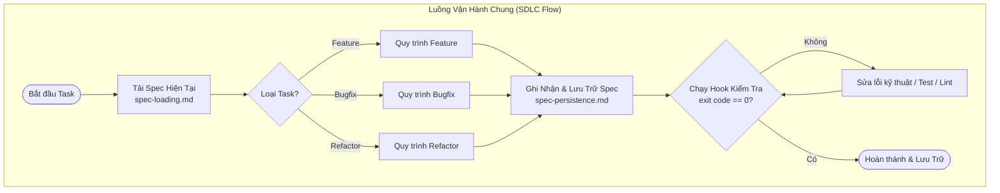
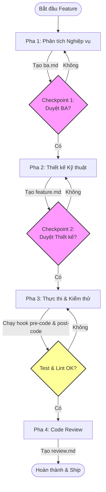
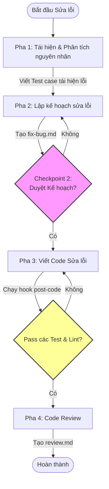
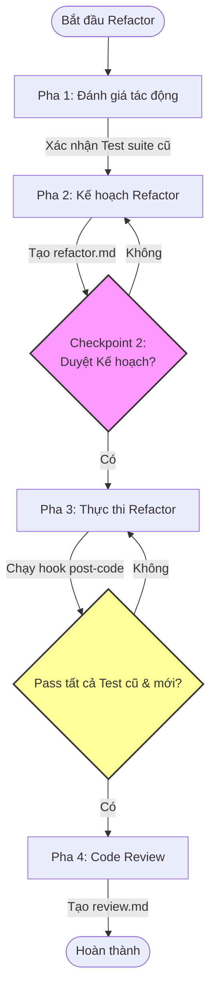

# Software Development Workflow with AI Agents

**`sk-specs`** là bộ khung cấu trúc tiêu chuẩn (Standard SDLC Framework) giúp định hình quy tắc (`rules`), kỹ năng (`skills`), quy trình thực thi (`workflows`) và biểu mẫu (`templates`) nhằm tối ưu hóa toàn bộ **vòng đời phát triển phần mềm (Software Development Lifecycle - SDLC)** của AI Agent (Gemini, Claude, Cursor) trên Client Workspace.

Dự án hỗ trợ cộng tác **Multi-Agent (Đa Agent)** thông qua cơ chế lưu trữ đặc tả liên tục (`spec-persistence`), giúp chia sẻ và kế thừa ngữ cảnh giữa các pha làm việc mà không làm mất tiến độ hay đứt gãy thông tin.

---

## Cấu Trúc Thư Mục Sau Khi Đồng Bộ (Workspace Directory Structure)

Dưới đây là sơ đồ cây thư mục sau khi đã đồng bộ hóa `sk-specs` vào dự án Client của bạn:

```txt
<client-project>/
│
├── .agents/                          # Cấu hình Agent (được quét tự động bởi IDE)
│   ├── skills/                       # Slash Commands (đồng bộ từ commands/)
│   │   ├── sk-ba/
│   │   │   └── SKILL.md
│   │   ├── sk-bugfix/
│   │   │   └── SKILL.md
│   │   ├── sk-continue/
│   │   │   └── SKILL.md
│   │   ├── sk-feature/
│   │   │   └── SKILL.md
│   │   ├── sk-refactor/
│   │   │   └── SKILL.md
│   │   ├── sk-review/
│   │   │   └── SKILL.md
│   │   └── sk-status/
│   │       └── SKILL.md
│   │
│   └── sk-specs/                     # Bản sao cấu hình gốc (rules, skills, workflows, templates)
│       ├── rules/
│       │   ├── architecture-rules.md
│       │   ├── core-rules.md
│       │   ├── folder-structure-and-export-rules.md
│       │   ├── import-rule.md
│       │   ├── output-format.md
│       │   ├── security-rules.md
│       │   ├── slash-commands.md
│       │   ├── spec-loading.md
│       │   ├── spec-persistence.md
│       │   └── testing-rules.md
│       │
│       ├── skills/
│       │   ├── business-analysis/
│       │   │   └── SKILL.md
│       │   ├── code-review-principles/
│       │   │   └── SKILL.md
│       │   ├── debugging-patterns/
│       │   │   └── SKILL.md
│       │   ├── feature-analysis/
│       │   │   └── SKILL.md
│       │   ├── frontend-stack/
│       │   │   └── SKILL.md
│       │   ├── performance-optimization/
│       │   │   └── SKILL.md
│       │   ├── react-zustand-patterns/
│       │   │   └── SKILL.md
│       │   ├── refactor-principles/
│       │   │   └── SKILL.md
│       │   ├── regression-safety/
│       │   │   └── SKILL.md
│       │   ├── reviewing-code/
│       │   │   └── SKILL.md
│       │   ├── systematic-debugging/
│       │   │   └── SKILL.md
│       │   └── vietnamese-assistant/
│       │       └── SKILL.md
│       │
│       ├── workflows/
│       │   ├── business-analysis.md
│       │   ├── code-review.md
│       │   ├── feature-analysis.md
│       │   ├── feature-architecture.md
│       │   ├── feature-task-breakdown.md
│       │   ├── fix-bug.md
│       │   ├── legacy-cleanup.md
│       │   ├── root-cause-analysis.md
│       │   ├── safe-refactor.md
│       │   └── testing-workflow.md
│       │
│       └── templates/
│           ├── ba.md
│           ├── decisions.md
│           ├── feature.md
│           ├── fix-bug.md
│           ├── progress.md
│           ├── refactor.md
│           ├── review.md
│           └── risks.md
│
└── sk-specs/                         # Dữ liệu tiến độ thực tế (tại root client workspace)
    ├── hooks/                        # Quality Gates scripts (đồng bộ từ hooks/ của repo)
    │   ├── pre-ba.js
    │   ├── post-ba.js
    │   ├── pre-design.js
    │   ├── post-design.js
    │   ├── pre-code.js
    │   ├── post-code.js
    │   ├── pre-review.js
    │   └── post-review.js
    │
    ├── active/                       # Các task đang được thực hiện
    ├── completed/                    # Các task đã hoàn thành
    └── archived/                     # Các tài liệu đã lưu trữ lịch sử
```

> [!NOTE]
> Trong repository này (`sk-specs`), các thư mục `commands/`, `rules/`, `skills/`, `workflows/`, `templates/` và `hooks/` được đặt trực tiếp ở thư mục gốc để quản lý và phát triển độc lập.
> Khi tích hợp vào dự án Client (Workspace):
>
> - Thư mục `commands/` ở gốc repository sẽ được sao chép và đồng bộ trực tiếp ra thư mục `.agents/skills/` của dự án client để IDE nhận diện thành các phím tắt lệnh gõ nhanh bắt đầu bằng dấu `/` (ví dụ: `/sk-ba`, `/sk-feature`,...).
> - Toàn bộ repository (bao gồm `rules/`, `skills/`, `workflows/`, `templates/` và `hooks/` -> `sk-specs/hooks/`) sẽ được copy gọn gàng vào bên trong `sk-specs/` của Client, giúp cô lập hoàn toàn và tránh làm ô nhiễm thư mục `.agents/` gốc của client (đảm bảo không ghi đè lên các rule/skill riêng của dự án client).

---

## 1. Cấu Trúc Hệ Thống (Architecture Layer)

Để hiểu chi tiết nhiệm vụ từng file trong hệ thống, vui lòng tham khảo [PROJECT_STRUCTURE.md](PROJECT_STRUCTURE.md). Dưới đây là tóm tắt các lớp chính:

| Thư mục      | Vai trò chính                                                                                    | Chi tiết tài liệu                |
| :----------- | :----------------------------------------------------------------------------------------------- | :------------------------------- |
| `rules/`     | Quy định, ràng buộc kỹ thuật bắt buộc của dự án (kiến trúc, đặt tên, import, kiểm thử).          | [Tài liệu Rules](rules/)         |
| `skills/`    | Kho tri thức và kinh nghiệm thực tiễn (Frontend stack, tối ưu hiệu năng, state-management).      | [Tài liệu Skills](skills/)       |
| `workflows/` | Quy trình thực thi từng bước (Phân tích, Thiết kế, Code, Test, Sửa lỗi, Tái cấu trúc).           | [Tài liệu Workflows](workflows/) |
| `commands/`  | Các Slash Commands đăng ký vào IDE giúp kích hoạt nhanh các luồng công việc.                     | [Tài liệu Commands](commands/)   |
| `hooks/`     | Các Quality Gates tự động kiểm soát chất lượng code trước và sau các pha.                        | [Tài liệu Hooks](hooks/)         |
| `templates/` | Mẫu tài liệu đặc tả chuẩn (`ba.md`, `feature.md`, `progress.md`...).                             | [Tài liệu Templates](templates/) |
| `sk-specs/`  | Nơi lưu trữ trạng thái đặc tả thực tế tại client project (`active/`, `completed/`, `archived/`). | [Tài liệu Specs](sk-specs/)      |

---

## 2. Quy Trình Cài Đặt & Đồng Bộ (Installation & Sync)

Tích hợp bộ khung quy chuẩn này vào dự án Client thông qua 2 phương thức:

### Cách 1: Sử dụng `npx` (Khuyên dùng)

Chạy trực tiếp từ thư mục gốc của dự án Client:

```bash
npx -p github:sunkid1995/sk-specs sk-specs
```

### Cách 2: Sử dụng Script cục bộ

Chạy từ thư mục của repository này:

```bash
./sync-agents.sh <đường-dẫn-đến-dự-án-client>
```

_Ví dụ:_ `./sync-agents.sh ../my-client-project`

### Chế độ Dry-run (Chạy thử nghiệm):

Cả hai phương thức đồng bộ trên đều hỗ trợ flag `--dry-run` để chạy thử nghiệm xem các thay đổi về file và thư mục mà không ghi đè bất kỳ tệp thực tế nào lên đĩa:

- Ví dụ npx: `npx -p github:sunkid1995/sk-specs sk-specs --dry-run`
- Ví dụ script cục bộ: `./sync-agents.sh ../my-client-project --dry-run`

> [!IMPORTANT]
> Cả hai phương thức đều bảo vệ dữ liệu thực tế: Thư mục `active/`, `completed/`, `archived/` chứa các tài liệu tiến trình thực tế sẽ **không bao giờ bị ghi đè hoặc xóa** nếu đã tồn tại ở client.

---

## 3. Sơ Đồ Quy Trình Làm Việc (Workflows & Diagrams)

Mọi luồng công việc đều tuân thủ nguyên lý: **Tải spec hiện tại (`spec-loading`) -> Thực thi & Cập nhật tiến độ (`progress.md`) -> Lưu trữ spec (`spec-persistence`) -> Kiểm tra tự động qua Hooks -> Phê duyệt qua Checkpoints.**



### 3.1. Luồng Phát Triển Tính Năng (Feature Workflow)

Kích hoạt bằng lệnh: `/sk-feature <mô-tả>`



### 3.2. Luồng Sửa Lỗi (Bugfix Workflow)

Kích hoạt bằng lệnh: `/sk-bugfix <mô-tả>`



### 3.3. Luồng Tái Cấu Trúc (Refactor Workflow)

Kích hoạt bằng lệnh: `/sk-refactor <mô-tả>`



---

## 4. Hệ Thống Slash Commands & Checkpoints

Để tăng tốc độ tương tác, gõ trực tiếp các lệnh gạch chéo `/` trong khung chat:

| Lệnh                   | Workflow kích hoạt  | Checkpoint dừng duyệt                                                                     | Kết quả đầu ra               |
| :--------------------- | :------------------ | :---------------------------------------------------------------------------------------- | :--------------------------- |
| `/sk-ba <mô-tả>`       | Business Analysis   | **Checkpoint 1 (BA Approval)**: Phê duyệt đặc tả nghiệp vụ trước khi thiết kế.            | `ba.md`                      |
| `/sk-feature <mô-tả>`  | Feature Development | **Checkpoint 2 (Design Approval)**: Phê duyệt thiết kế kỹ thuật trước khi code.           | `feature.md`, `progress.md`  |
| `/sk-bugfix <mô-tả>`   | Bug Fix             | **Checkpoint 2 (Design Approval)**: Phê duyệt kế hoạch sửa lỗi và test case tái hiện lỗi. | `fix-bug.md`, `progress.md`  |
| `/sk-refactor <mô-tả>` | Safe Refactoring    | **Checkpoint 2 (Design Approval)**: Phê duyệt phạm vi tái cấu trúc và rủi ro hồi quy.     | `refactor.md`, `progress.md` |
| `/sk-review`           | Code Review         | Không dừng, tự động quét và đánh giá mã nguồn thực tế.                                    | `review.md`                  |
| `/sk-continue`         | Resume Progress     | Đọc các file spec và tiếp tục task đang dang dở.                                          | Khôi phục ngữ cảnh           |
| `/sk-status`           | Project Status      | Không dừng, truy vấn trạng thái hiện tại của dự án và các tệp đặc tả.                     | Báo cáo tiến độ dự án        |

---

## 5. Cơ Chế Agent Hooks (Quality Gates)

Các Hook tự động chạy tại các điểm vòng đời nhằm bảo vệ chất lượng dự án tại Client Workspace. Hooks được lưu tại `sk-specs/hooks/` ở root client workspace.

| Hook                 | Loại      | Chức năng                                                                                                                    |
| :------------------- | :-------- | :--------------------------------------------------------------------------------------------------------------------------- |
| **`pre-ba.js`**      | Pre-hook  | Cảnh báo chồng chéo nếu có tính năng song song khác đang phát triển trong `sk-specs/active/`.                                |
| **`post-ba.js`**     | Post-hook | Placeholder — mở rộng xử lý sau khi hoàn thành BA.                                                                           |
| **`pre-design.js`**  | Pre-hook  | Chặn thiết kế kỹ thuật nếu `ba.md` chưa hoàn thiện hoặc còn chứa placeholder (`TODO`, `TBD`).                                |
| **`post-design.js`** | Post-hook | Placeholder — mở rộng xử lý sau khi hoàn thành thiết kế.                                                                     |
| **`pre-code.js`**    | Pre-hook  | Phát hiện và cảnh báo các component, hook, utility bị trùng tên hoặc sai cấu trúc folder (Flat files).                       |
| **`post-code.js`**   | Post-hook | Tự động chạy unit test (`vitest`) và linter (`eslint`). Ràng buộc tỷ lệ coverage tối thiểu 80%.                              |
| **`pre-review.js`**  | Pre-hook  | Đảm bảo checklist tiến độ hoàn thành và có thay đổi mã nguồn thực tế trong Git trước khi tạo review.                         |
| **`post-review.js`** | Post-hook | Kiểm tra khi có `review.md` và `progress.md` đạt `Completed` để di chuyển thư mục tiến trình từ `active/` sang `completed/`. |

> [!CAUTION]
> Nếu bất kỳ script hook nào trả về mã lỗi (`exit code != 0`), Agent sẽ **dừng lại ngay lập tức** và yêu cầu người dùng khắc phục lỗi trước khi chuyển bước tiếp theo.

### Cơ chế Versioning & Bảo vệ Hook Tùy Chỉnh (Hook Versioning & Conflict Resolution)

Các Hook mẫu trong `sk-specs/hooks/` được đồng bộ từ kho chứa nguồn và nâng cấp tự động nhờ cơ chế so khớp SHA-256 qua manifest tệp `.hooks-manifest.json`:

- Khi cập nhật cấu hình `sk-specs`, nếu người dùng **chưa tùy chỉnh** các tệp hook (mã băm của tệp khớp với mã băm lưu tại manifest): Các tệp hook sẽ tự động được ghi đè phiên bản mới nhất.
- Nếu người dùng **đã tùy biến** logic hook (mã băm hiện tại khác phiên bản manifest): Phiên bản nâng cấp mới của hook sẽ được lưu dưới tên `<tên-hook>.upstream` (ví dụ: `pre-code.js.upstream`). Người dùng có thể so sánh và thực hiện merge thủ công để không bị mất các logic tùy chỉnh riêng của dự án.

## 6. Cấu Hình Động (Dynamic Configuration) qua `sk-specs.config.json`

Bộ khung hỗ trợ cơ chế cấu hình động giúp tách biệt logic dùng chung của AI Agent và cấu trúc nghiệp vụ đặc thù của từng dự án client (như các aliases, thư mục bỏ qua, danh sách stop words hoặc từ khóa nghiệp vụ).

### 6.1. Tệp cấu hình `sk-specs.config.json`
Tệp cấu hình đặt tại thư mục gốc của dự án Client. Ví dụ cấu trúc tệp:

```json
{
  "aliasToSrc": {
    "@components": "app/components",
    "@hooks": "app/hooks",
    "@store": "app/store"
  },
  "ignoredDirs": [
    "node_modules", ".git", "dist", "build", ".agents", "coverage"
  ],
  "sourceExtensions": [".ts", ".tsx", ".js", ".jsx"],
  "featureKeywords": [
    "auth", "todo", "chat", "setting"
  ],
  "stopWords": [
    "fix", "refactor", "update", "and", "the"
  ]
}
```

### 6.2. Cơ chế tự động tìm nạp (Automatic Configuration Resolution)
Theo quy tắc cấu hình trong [core-rules.md](rules/core-rules.md), Agent được yêu cầu hoạt động hoàn toàn tự động mà không cần người dùng tự khai báo thủ công:
1. **Kiểm tra tự động**: Agent sẽ tìm nạp `sk-specs.config.json` khi bắt đầu công việc.
2. **Tự động phân tích & khởi tạo**: Nếu chưa có tệp hoặc thiếu các trường cấu hình cốt lõi, Agent bắt buộc phải tự quét mã nguồn của Client (aliases từ `tsconfig.json` hoặc `vite.config.ts`, các folder nghiệp vụ, cấu trúc thư mục) và tự động tạo mới hoặc cập nhật đầy đủ các trường vào tệp `sk-specs.config.json`.

---

## 7. Lợi Ích & Tầm Nhìn Kỹ Thuật

- **Context Continuity (Tính liên tục)**: Chuyển giao công việc giữa các Agent dễ dàng, không phụ thuộc vào bộ nhớ chat cũ.
- **Deterministic Outputs (Tính nhất quán)**: Thiết kế mã nguồn có tính kế thừa và thống nhất, giảm thiểu mã nguồn bị phân mảnh.
- **Prompt Size & Cost Control (Tiết kiệm token)**: Tiết kiệm token và tăng tốc độ xử lý vì Agent chỉ cần nạp tệp đặc tả tinh giản thay vì quét toàn bộ repository lớn.
- **Regression Safety (An toàn hồi quy)**: Bắt buộc phải viết test case tái hiện lỗi và đảm bảo test suite chạy thành công trước khi ship code.
