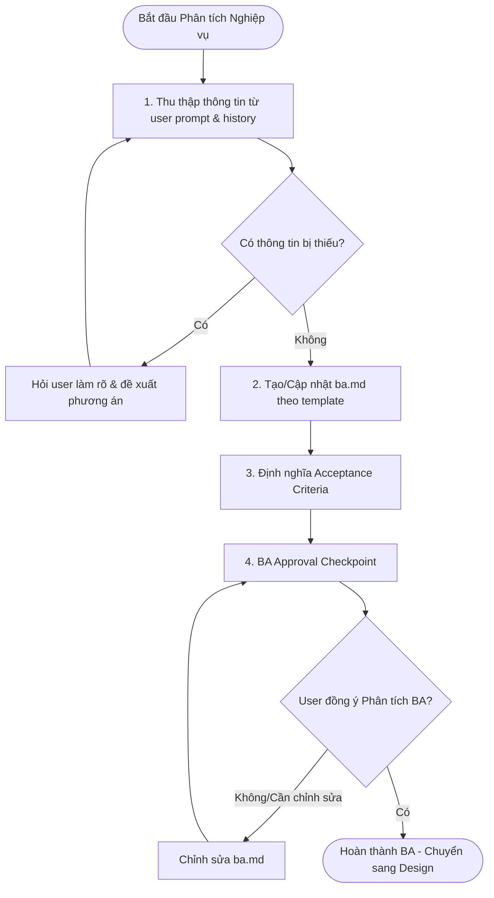

# Business Analysis Discipline

## Core Principles

Always identify:

- Business goals
- User goals
- Stakeholders
- Dependencies
- Edge cases
- Acceptance criteria
- Risks
- Assumptions

Never:

- Jump into implementation
- Assume missing requirements

## Analysis Process & Structure

Whenever analyzing a feature, ALWAYS identify and document the following sections. Write these findings inside the `sk-specs/<feature-name>/01-feature-analysis.md` file (or print them clearly if no spec folder exists yet):

### 1. Goals & Value

- **Business Goals**: Why is this feature needed? What business value does it drive?
- **User Goals**: What does the end user want to accomplish? What pain point is being resolved?
- **Stakeholders**: Who will use this? (e.g., admin, member, anonymous visitor).

### 2. Boundaries & Scope

- **In-Scope**: Clear list of features/pages/actions included.
- **Out-of-Scope**: Explicitly state what is NOT built in this phase (YAGNI principle).
- **Assumptions**: Document any business assumptions being made about user behavior or dependencies.

### 3. Dependencies & Integrations

- **API Dependencies**: What new or existing backend endpoints are required?
- **State Dependencies**: How does this impact Zustand store structures? Does it fetch from TanStack Query?
- **Realtime / Socket**: Does it require real-time updates via SocketCluster?
- **Local Storage / Persistence**: Does the preference or state need to be persisted locally?

### 4. Domain-Specific Edge Cases & Risks

For a chat application, always investigate:

- **Network & Connectivity**: What happens if the socket disconnects or the user is offline?
- **Optimistic Updates**: How do we handle failures after displaying optimistic UI state?
- **Race Conditions**: What happens if the user spams clicks or inputs duplicate commands quickly?
- **Empty States**: How does the UI look when there is no data, no search results, or loading?
- **Permissions**: What if the user role does not permit this action?
- **Risks**: Identify technical or business risks (e.g., performance impact of loading large datasets).

### 5. Acceptance Criteria

- Explicit, verifiable bullet points specifying exactly what the feature must do to be considered "Done".

## Constraints

- **Never jump into implementation**: Do not create implementation plans or modify files until these business details are signed off.
- **Never assume requirements**: If any criteria or edge cases are unclear, prompt the user for clarification with specific recommendations.
