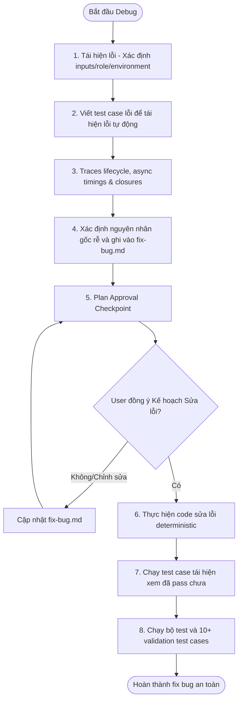

# Debugging Strategy & Patterns

## Debugging Priorities & Rules
1. **Find Root Cause First**: Never patch symptoms blindly (e.g., adding arbitrary null-guards or timeouts). Investigate *why* the bad state occurred.
2. **Reproducibility**: Establish clear reproduction conditions before proposing a fix.
3. **Safe Scope**: Make the minimal possible code changes to address the issue.
4. **Regression Prevention**: Verify adjacent modules and check for side-effects.

## Common Frontend Bug Sources
When investigating issues in React and Zustand, check for:
- **Stale React State**: Missing dependency array items in `useEffect`/`useCallback` or stale closures.
- **Async Race Conditions**: Rapid concurrent actions or API updates resolving out of order.
- **Zustand Persistence Mismatch**: Store schema changes mismatching cached localStorage data.
- **Hydration Timing**: Server-rendered SSR layout differing from client-side mount.
- **Derived State Inconsistency**: Redundant state stored locally instead of computed via selectors.

## Systematic Debugging Lifecycle

### Step 1: Reproduce & Isolate
- Define the exact reproduction path (inputs, user role, environment).
- Isolate the error to the render layer, state store, or API/Socket layer.
- Write a failing test case first if applicable.

### Step 2: Root Cause Analysis
- Trace the lifecycle of state transitions, async timings, and closures.
- Ensure the proposed solution addresses the source, not just the symptom.

### Step 3: Implement Safe Fix
- Apply deterministic, targeted changes. Avoid manual timeouts or fragile delays.

### Step 4: Verify & Check Regressions
- Verify the fix against the reproduction conditions.
- Test related components, offline sync behavior, and boundary states.
