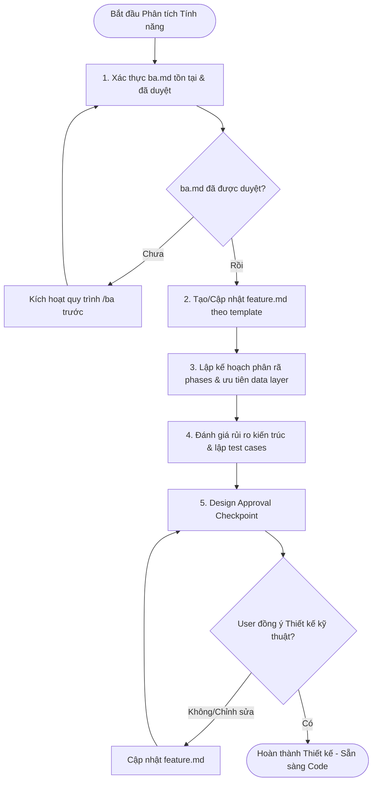

# Feature Analysis Behavior

When a feature request is initiated via a prompt starting with `Feature:`, automatically analyze the requirements and draft a technical roadmap before writing any implementation code.

All outputs must be written directly to `sk-specs/<normalized-feature-name>/01-feature-analysis.md` (or printed clearly if no spec directory exists yet).

## Required Output Sections

The analysis must strictly follow the output format requirements:

- **Feature Summary**: Short overview of the feature scope, target value, and affected modules.
- **Requirements Analysis**: Detail the functional requirements, technical/API needs, state persistence requirements, and UI/UX state behaviors (loading, empty, error states).
- **Implementation Phases**: Divide the implementation into incremental, testable phases. Ensure data/store layers are ordered before UI components.
- **Reusable Modules**: Identify shared hooks, storage wrappers, or components that can be extracted or reused.
- **Technical Risks**: Assess potential edge cases, race conditions, sync issues, or data integrity risks.
- **Execution Order**: Map out the exact implementation sequence and dependencies.
- **Validation Strategy**: Plan how to verify the changes via unit, integration, and regression tests.

## Key Restrictions

- Do NOT implement production code unless explicitly requested.
- Do NOT generate unnecessary boilerplate or overengineer simple features.
