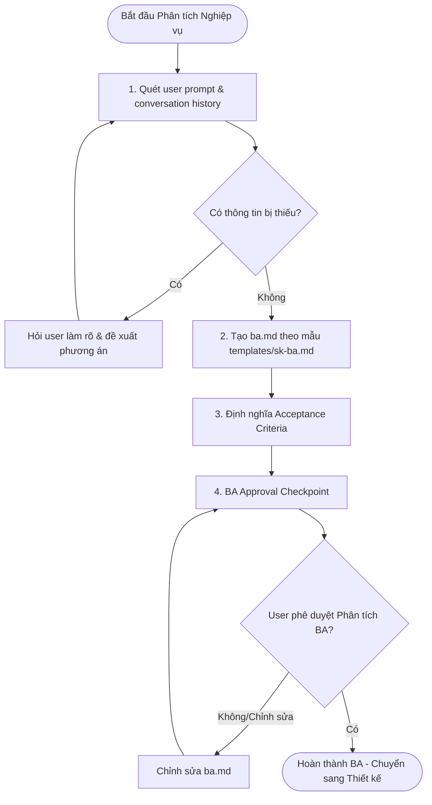

# REQUIRED INPUT

- Prompt description or requirement context from the user.

# WORKFLOW STEPS

## 1. Information Gathering
- Scan the user prompt and conversation history to identify the core feature goal.
- Never make assumptions about missing requirements. Ask the user for clarification with specific recommendations.

## 2. Core Specification Writing
- Automatically create or update `ba.md` inside `sk-specs/active/<work-item-name>/` using `templates/sk-ba.md` as a layout.
- Define Business & User Goals, Stakeholders, Scope (In/Scope & Out-of-Scope), Dependencies, and Risks.
- Investigate chat-specific edge cases (offline sync, socket disconnects, permissions, race conditions).

## 3. Acceptance Criteria Definition
- Write clear, binary (pass/fail) acceptance criteria to guide implementation and QA.

## 4. BA Approval Checkpoint (Blocking)
- Present the drafted `ba.md` content to the user.
- Ask the user (BA Checkpoint): *"Bạn có muốn thay đổi hay bổ sung gì cho tài liệu Phân tích Nghiệp vụ (BA) này không?"*
- Stop and wait for user confirmation. Do NOT proceed to the design/architecture phase until the user explicitly approves.

# OUTPUT

The generated `ba.md` must contain these exact sections:

- Business Goal
- Functional Requirements
- Non Functional Requirements
- Acceptance Criteria
- Dependencies
- Assumptions
- Open Questions
- Edge Cases
- Out Of Scope
- Risks