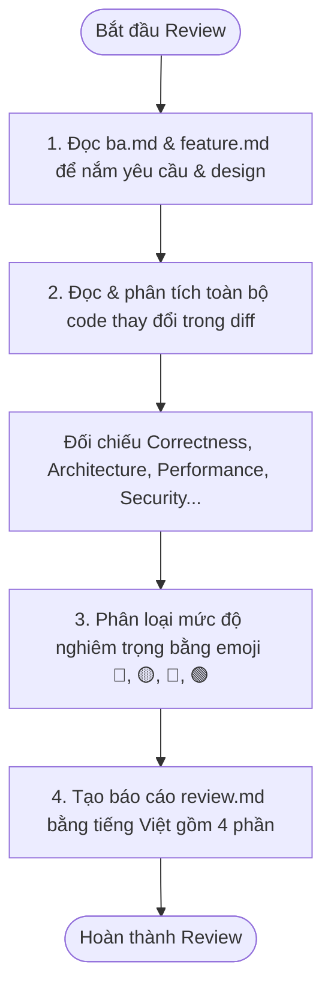

# REQUIRED INPUT

- ba.md
- feature.md (or refactor.md/fix-bug.md)
- Code diffs (changes in the workspace)

# WORKFLOW STEPS

## 1. Context & Business Verification
- Read the requirements and acceptance criteria in `ba.md`.
- Understand the technical design decisions described in `feature.md` (or `refactor.md`/`fix-bug.md`).

## 2. Code Inspection & Analysis
- Inspect the changed files completely.
- Map findings systematically against the review dimensions: Correctness, Architecture, Maintainability, Performance, Security, Testing, and UI/UX.

## 3. Severity Classification
- Grade and group findings by severity using color-coded emojis:
  - 🔴 **Critical** (Bugs, security risks, logic failures)
  - 🟡 **Important** (Convention violations, re-renders, import issues)
  - 🔵 **Minor** (Style nits, small cleanups)
  - 🟢 **Positive / Nitpick** (Good implementations, suggestions)

## 4. Report Generation
- Generate the structured review report `review.md` under `sk-specs/active/<work-item-name>/` using `templates/sk-review.md`.
- The report must strictly contain 4 Vietnamese sections:
  1. *Đánh giá tổng thể*
  2. *Đánh giá bổ sung*
  3. *Các điểm rủi ro và cần lưu ý* (containing risk assessment matrix with mitigation)
  4. *Đánh giá chi tiết mã nguồn* (using color-coded severity emojis)

# OUTPUT

The generated `review.md` (Structured Vietnamese review report) must contain these exact sections:

- Business Validation
- Architecture Validation
- Implementation Validation
- Issues
- Recommendations
- Approval Status