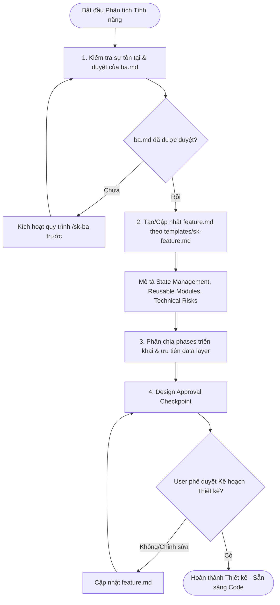

# REQUIRED INPUT

- ba.md (Approved under `sk-specs/active/<work-item-name>/`)

# WORKFLOW STEPS

## 1. BA Verification
- Confirm that `ba.md` exists and is approved. If `ba.md` does not exist or is not signed off, execute the `/sk-ba` workflow first.

## 2. Technical & Architectural Analysis
- Create or update `feature.md` under `sk-specs/active/<work-item-name>/` using the layout in `templates/sk-feature.md`.
- Detail the functional requirements, state management strategy, persistence requirements, and reusable modules.
- Assess architectural risks (e.g., SSR hydration mismatch, race conditions, type safety).

## 3. Phased Implementation Planning
- Break down the implementation into incremental, testable phases.
- Ensure data layers (APIs, Zustand stores) are prioritized and implemented before UI components.
- Establish validation strategy and test cases (minimum 10 test cases or 5 technical risks).

## 4. Design Approval Checkpoint (Blocking)
- Present the drafted `feature.md` content to the user.
- Ask the user (Design Checkpoint): *"Bạn có muốn chỉnh sửa gì trong thiết kế kỹ thuật/kế hoạch triển khai này không?"*
- Stop and wait for user confirmation. Do NOT write or modify application code until the plan is approved.

# OUTPUT

The generated `feature.md` must contain these exact sections:

- Feature Summary
- Architecture Impact
- State Management
- Reusable Modules
- Execution Plan
- Technical Risks
- Test Cases