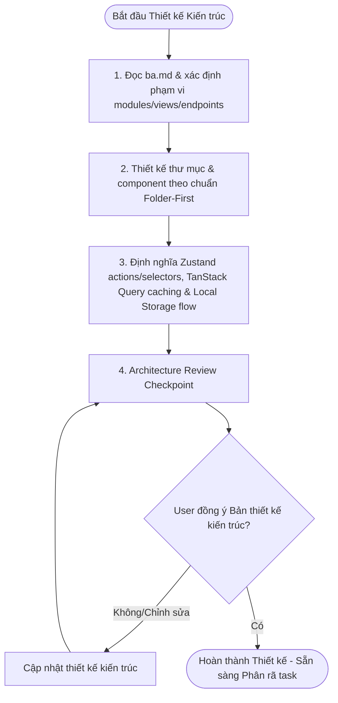

# REQUIRED INPUT

- ba.md
- Feature description context

# WORKFLOW STEPS

## 1. Scope Identification
- Read the approved `ba.md` to identify all modules, endpoints, and UI views that require architectural design.

## 2. Directory & Component Design
- Map out the folder structure using Folder-First conventions (every component/hook/store inside its own directory with an `index.ts`/`index.tsx`).
- Identify shared or reusable components that should be placed in `src/app/components/shared/`.

## 3. State & Data Flow Mapping
- Define client-side Zustand store actions, selectors, and action label formatting (`'storeName/actionName'`).
- Outline TanStack Query caching and mutations logic for server interaction.
- Detail the local storage persistence/hydration flow if state persistence is required.

## 4. Architecture Review Checkpoint (Blocking)
- Output the architectural design blueprint.
- Ask the user (Design Checkpoint): *"Bạn có muốn chỉnh sửa gì trong thiết kế kỹ thuật/kế hoạch triển khai này không?"*
- Stop and wait. Do NOT implement files until the user explicitly approves.

# REQUIRED OUTPUTS

The architecture design must define:

- folder structure
- state management strategy
- reusable modules
- type definitions
- persistence flow
- scalability considerations