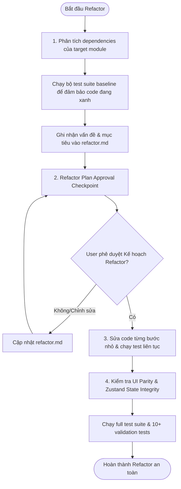

# REQUIRED INPUT

- ba.md (Retrieve existing or create via reverse-engineering if legacy code)
- old-test-cases

# WORKFLOW STEPS

## 1. Dependency Analysis & Baseline Check
- Map the target module's import/export dependencies.
- Run all existing test cases (`yarn test`, `npm run test`, `yarn test:jest`, or `vitest`) to verify that the current codebase is green.
- Document current problems, refactor goals, and initial state in `refactor.md` (under `.agents/sk-specs/active/<work-item-name>/` using `templates/refactor.md`).

## 2. Refactor Plan Approval (Blocking)
- Outline the step-by-step refactoring strategy (hook extraction, state isolation, selector usage, component splitting).
- Assess regression risks on adjacent modules.
- Present the plan to the user.
- Ask the user (Design Checkpoint): *"Bạn có muốn chỉnh sửa gì trong kế hoạch tái cấu trúc (refactor) này không?"*
- Stop and wait. Do NOT make code modifications until the user explicitly approves.

## 3. Incremental Implementation
- Modify code in small, isolated steps.
- Commit or save frequently. Rerun tests after each incremental change to prevent regressions.
- Verify UI visual parity (no shifts or layout breaks) and Zustand state hydration/storage integrity.

## 4. Final Validation
- Run the full test suite to ensure no existing tests are broken.
- Execute at least 10 regression validation test cases.
- Record the pre-refactor and post-refactor execution logs inside `refactor.md`.

# VALIDATION

- Minimum: 10 regression validation test cases passing successfully (including old tests + new verification tests).

# OUTPUT

The generated `refactor.md` must contain these exact sections:

- Current Problems
- Refactor Goals
- Refactor Plan
- Regression Risks
- Validation Strategy
- Pre-Refactor Test Execution Log (Confirm all old tests pass)
- Post-Refactor Test Execution Log (Confirm all old & new tests pass)